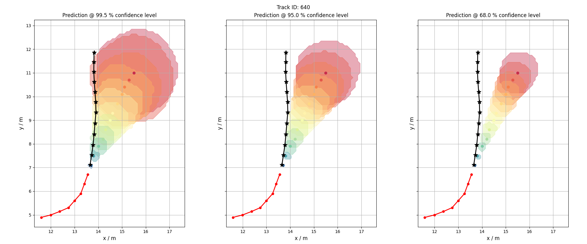
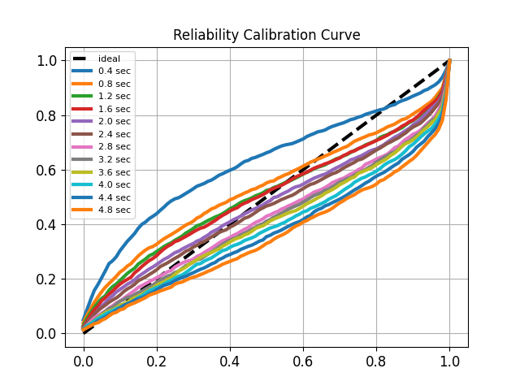
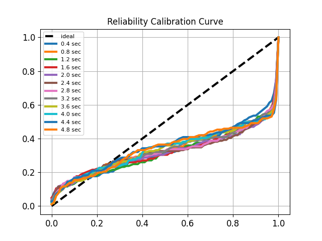

### Are We Pursuing the Right Objective? An Human Trajectory Predicition Evaluation Framework
An extensive Human Trajectory Prediction (HTP) Evaluation Framework to boost evaluation in terms of reliability and trustworthiness, aiming for real-world applicability. Its not all about ADE/FDE accuracy.

<figure>
    
    <figcaption>Example HTP with distribution source evaluation using confidence levels. Input horizon (red), GT forecast horizon (black), and a models predicition distribution source for each timestamp and three different confidence levels (99.5%, 95.0% and 68.0%).</figcaption>
</figure>

<figure>
    
    
    <figcaption>Example model reliability calibration curves. The black dash line represents the ideal calibration and optimization goal. Colored lines represent the calibration for discrete forecast horizon steps.</figcaption>
</figure>

#### Paper:
**..., "Are We Pursuing the Right Objective? A Survey in Human Trajectory Prediction", ...**

**Links:**
<!-- - IEEE Explore: [[click here]]()
 - ResearchGate: [[click here]]()
 - ArXiv: [[click here]]()
-->

<!-- #### Citation:
If you use our code/method, please cite:
```
@INPROCEEDINGS{,
  author={},
  booktitle={}, 
  title={Reliable Probabilistic Human Trajectory Forecasts for Autonomous Applications}, 
  year={},
  volume={},
  number={},
  pages={},
  doi={}
}
``` -->

---
### Table of contents:
* [Overview](#overview)
* [Requirements](#requirements)
* [Framework Datasets](#datasets)
* [Data Preprocessing](#prepro)
* [Included Metrics](#metrics)
* [Evaluation Examples](#evaluation)
* [Sources](#sources)
* [License](#license)

---
<a name="overview"></a>
### Overview
This repository contains all information for our Humand Trajectory Prediction (HTP) Evaluation Framework from the Paper: "Are We Pursuing the Right Objective? A Survey in Human Trajectory Predictions". We provide example data from some well-known HTP Frameworks to reproduce our results and furthermore instructions to use this evaluation framework to improve HTP evaluation. The framework consists of two python classes, a data-loader and the evaluation class for easy adaption and usage. The included metrices are listed below and a short explanation for each metric can be found in [[Metric Descriptions]](metrics.md).

---
<a name="Requirements"></a>
### Requirements
We use the following system configuration. All additional required python packages are listed in the requirements.txt file.

```
Ubuntu 22.04 LTS
Python 3.10
Pytorch 2.4
```

---
<a name="Included Metrics"></a>
### Included Metrics
The following HTP Evaluation metrics are included within this framework.

| Metric | Source | Type    |
|:----------------:|:-------------:|:---------:|
| Reliability (avg_RLS, min_RLS)    | [[1]](https://ieeexplore.ieee.org/document/8814258), [[2]](https://ieeexplore.ieee.org/document/9827220), [[3]](https://)  | $${\color{green}Probabilistic}$$ |
| Sharpness (SS)    | [[1]](https://ieeexplore.ieee.org/document/8814258), [[2]](https://ieeexplore.ieee.org/document/9827220), [[3]](https://)  | $${\color{green}Probabilistic}$$ |
| Average Mahalanobis Distance (AMD)    | [[4]](https://www.ecva.net/papers/eccv_2022/papers_ECCV/papers/136820451.pdf)  | $${\color{green}Probabilistic}$$ |
| Average Maximum Eigenvalue (AMV)    | [[4]](https://www.ecva.net/papers/eccv_2022/papers_ECCV/papers/136820451.pdf)  | $${\color{green}Probabilistic}$$ |
| Probability Cumulative Minimum Distance (PCMD)    | [[5]](https://openaccess.thecvf.com/content/ICCV2021/papers/Chen_Personalized_Trajectory_Prediction_via_Distribution_Discrimination_ICCV_2021_paper.pdf)  | $${\color{green}Probabilistic}$$ |
| KDE-Negative-Log-Likelihood (KDE-NLL)    | [[6]](https://www.ecva.net/papers/eccv_2020/papers_ECCV/papers/123630664.pdf)  | $${\color{green}Probabilistic}$$ |
| ADE/FDE @ Confidence Levels    | [[3]](https://)  | $${\color{green}Probabilistic}$$ |
| Best of K min ADE/FDE   | [[7]](https://ieeexplore.ieee.org/document/5459260)  | $${\color{blue}Detemernistic}$$ |
| Joint ADE/FDE (JADE,JFDE)   | [[8]](https://openaccess.thecvf.com/content/ICCV2023/papers/Weng_Joint_Metrics_Matter_A_Better_Standard_for_Trajectory_Forecasting_ICCV_2023_paper.pdf)  | $${\color{blue}Detemernistic}$$ |
| Average- and Final-Self-Distance (ASD/FSD)   | [[9]](https://arxiv.org/pdf/1907.04967)  | $${\color{blue}Detemernistic}$$ |

---
<a name="Framework Datasets"></a>
### Framework Datasets

We already extracted sampled data from the following HTP Frameworks using the ETH/UCY dataset to run our evaluation framework. For data extraction and to get distributional prediction representation we sampled 1000 positions per forecast horizon timestep and already fitted mixture distributions to this positions. After downloading the data, extract it to your preferred working directory. The data is already splitted into the classical ETH/UCY subsplits (eth, hotel, univ, zara1, zara2). All processed results will be stored within the subsplits location.

| Framework | Download Data | Status    |
|:----------------:|:-------------:|:---------:|
| Trajectron++     | tba           | $${\color{gray}na}$$ |
| Social-Implicit  | tba           | $${\color{gray}na}$$ |
| MID              | tba           | $${\color{gray}na}$$ |
| FlowChain        | tba           | $${\color{gray}na}$$ |


---
<a name="Data Preprocessing"></a>
### Data Preprocessing
You can use this HTP Evaluation Framework for your own method/data. The framework accepts the following input data formats: .npy, .pth, .h5
The necessary data structure is described in [[Data Specification]](data_structure.md). And the data can be loaded like this:

```python
from loader import Numpy_Loader

# Init numpy loader
loader = Numpy_Loader(input_path=input_path, 
                      gt_path=gt_path, 
                      k_samples_path=k_samples_path, 
                      full_samples_path=full_samples_path, 
                      gmms_path=gmms_path)

# Load data
input_data = loader.load_input()
gt_data = loader.load_gt()
full_samples_data = loader.load_samples()

# Fit mixtures to sample data
gmms_data = loader.fit_gmms_to_samples(samples=full_samples_data, 
                                        method='em', 
                                        n_components=n_components, 
                                        n_forecast_horizons=n_forecast_horizons, 
                                        n_iters=500, 
                                        n_parallel=12)

# Save fitted mixtures to file
loader.write_gmms(gmms_data, 
                  path=gmms_path)

# Load fitted data
gmms_data = loader.load_gmms()

```


---
<a name="Evaluation Examples"></a>
### Evaluation Examples
Our framework consists of a data-loader class and an evalaution class for easy usage/integration. The following example demonstrates how to evaluate our provided input data for the Trajectron++ framework.

```python
import json
from traj_eval import HTP_Eval
from loader import Numpy_Loader

# Init numpy loader
loader = Numpy_Loader(input_path=input_path, 
                      gt_path=gt_path, 
                      k_samples_path=k_samples_path, 
                      full_samples_path=full_samples_path, 
                      gmms_path=gmms_path)

# Load data
input_data = loader.load_input()
gt_data = loader.load_gt()
full_samples_data = loader.load_samples()
gmms_data = loader.load_gmms()

# Init evaluation
results = []
eval = HTP_Eval(cfg=cfg, 
                input=input_data, 
                gt=gt_data, 
                full_samples=full_samples_data, 
                torch_gmms=torch_gmms_data)

# calc metrices
results.append(eval.get_ade_fde(k=20))
results.append(eval.get_ade_fde_for_cls(k=20))
results.append(eval.get_rls(with_plot=True))
results.append(eval.get_ss(n_parallel=4))
results.append(eval.get_amd_amv(n_parallel=1))
results.append(eval.get_kde_nll(n_parallel=1))
results.append(eval.get_pcmd(k=80, with_plot=True))

# save scores
result_dict = eval.combine_dicts(dict_list=results)
with open(os.path.join(cfg['dest_dir'], 'results.json'), 'w') as f: json.dump(result_dict, f)

# vis prediction confidence levels
eval.vis_predictions(n_parallel=8, step=32)

# vis gmm fit results
eval.vis_gmm_fits(n_parallel=8, step=32)

sys.exit()

```

---
<a name="sources"></a>
### Sources
We want to thank the creators of [[Trajectron++]]([https://](https://github.com/StanfordASL/Trajectron-plus-plus)) , [[Social-Implicit]]([https://](https://github.com/abduallahmohamed/Social-Implicit)), [[MID]]([https://](https://github.com/Gutianpei/MID)) and [[FlowChain]]([https://](https://github.com/meaten/FlowChain-ICCV2023)) for their great work and openness by publically sharing their code, data, metrics and models. Moreover the creators of [[MDN]]([https://](https://github.com/kav-institute/mdn_trajectory_forecasting)), [[DisDis]]([https://](https://github.com/CHENGY12/DisDis)), [[DPP]]([https://](https://github.com/Gruntrexpewrus/TrajectoryFor-and-DPP)) and [[Joint-ADE]]([https://](https://github.com/ericaweng/joint-metrics-matter)) for releasing their code and metrics. If you use any of their data or code please cite the corresponding works!

References:
```
[1]: Zernetsch, Stefan et al. "Trajectory Forecasts with Uncertainties of Vulnerable Road Users by Means of Neural Networks." 2019 IEEE Intelligent Vehicles Symposium (IV).
[2]: Zernetsch, Stefan et al. "A Holistic View on Probabilistic Trajectory Forecasting – Case Study. Cyclist Intention Detection." 2022 IEEE Intelligent Vehicles Symposium (IV).
[3]: Hetzel, Manuel et al. "Reliable Probabilistic Human Trajectory Prediction for Autonomous Applications." 2024 IEEE European Conference on Computer Vision (ECCV).
[4]: Mohamed, Abduallah A. et al. “Social-Implicit: Rethinking Trajectory Prediction Evaluation and The Effectiveness of Implicit Maximum Likelihood Estimation.” 2022 IEEE European Conference on Computer Vision (ECCV).
[5]: Chen, Guangyi et al. “Personalized Trajectory Prediction via Distribution Discrimination.” 2021 IEEE International Conference on Computer Vision (ICCV).
[6]: Salzmann, Tim et al. “Trajectron++: Dynamically-Feasible Trajectory Forecasting with Heterogeneous Data.” 2020 IEEE European Conference on Computer Vision (ECCV).
[7]: S. Pellegrini et al. "You'll never walk alone: Modeling social behavior for multi-target tracking." 2009 IEEE International Conference on Computer Vision (ICCV).
[8]: Weng, Erica et al. “Joint Metrics Matter: A Better Standard for Trajectory Forecasting.” 2023 IEEE International Conference on Computer Vision (ICCV).
[9]: Yuan, Ye et al. “Diverse Trajectory Forecasting with Determinantal Point Processes.” 2020 IEEE International Conference on Learning Representives (ICLR).
```

---
<a name="license"></a>
### License
This project is licensed under the Apache 2.0 License - see the [LICENSE](LICENSE) file for details

---

